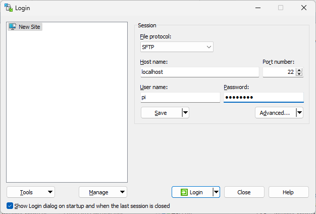
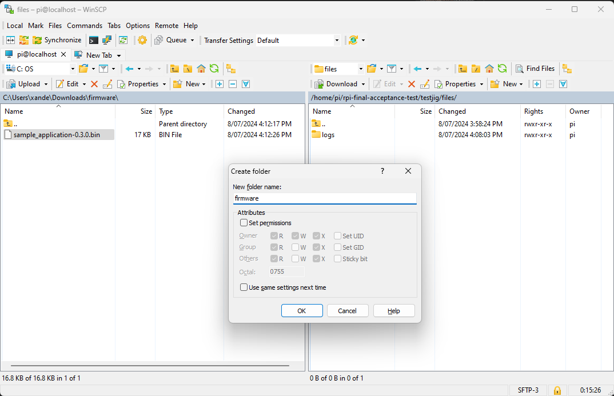
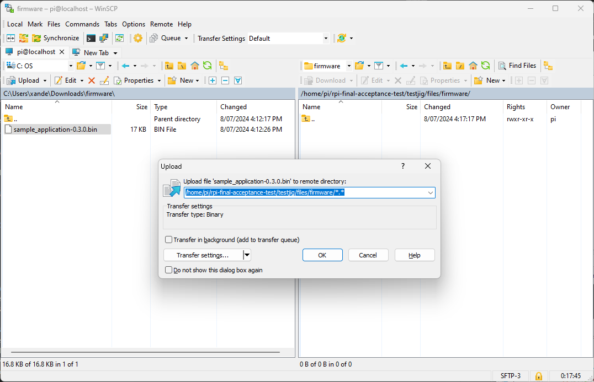
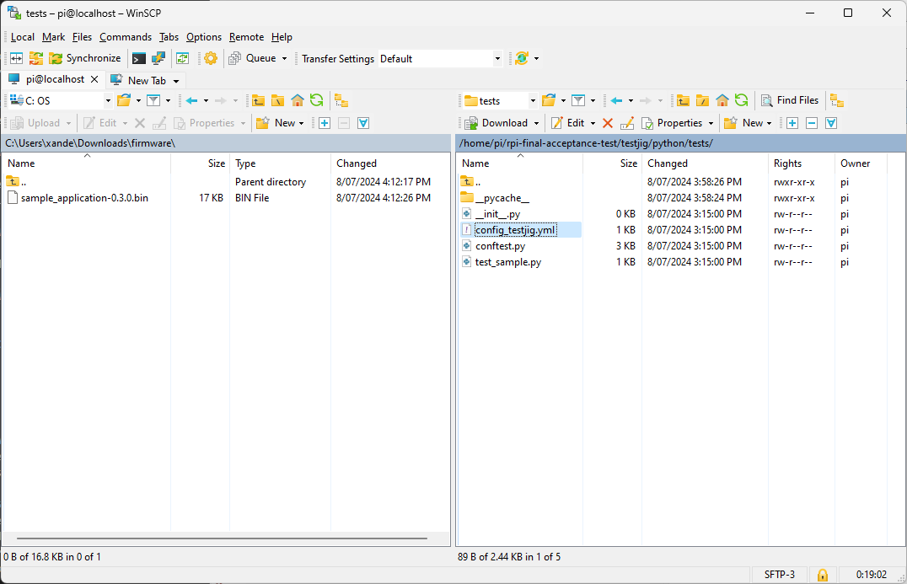

# Introduction
This is the second part of a two part workshop. The first part and introduction can be found in the following repository: [xanderhendriks/rpi-embedded-target-action-runner](https://github.com/xanderhendriks/rpi-embedded-target-action-runner).

It uses the same [hardware](https://github.com/xanderhendriks/rpi-embedded-target-action-runner?tab=readme-ov-file#hardware-used) and assumes the SD Card for the RFaspberry Pi is prepared as described in [preparing-the-sd-card](https://github.com/xanderhendriks/rpi-embedded-target-action-runner?tab=readme-ov-file#preparing-the-sd-card)

# Software used
Install the following software locally:
- [WinSCP](https://winscp.net/eng/download.php)

# Accounts used
- [Github](https://github.com/)

# Fork the workshop repository
Fork the [xanderhendriks/rpi-embedded-target-action-runner](https://github.com/xanderhendriks/rpi-final-acceptance-test) repository:

# Install the RPi software
## SSH login
login to the RPi using ssh. Add the -L to forward port 22 to allow sftp file transfer on localhost. And add the -A option for ssh agent forwarding to the RPi. This will allow you to use your github ssh certificate without having to transfer it to the RPi. Check [ssh-agent-forwarding](ssh-agent-forwarding.md) to see how to set this up:

    ssh pi@nxs-<RPi identifier> -A -L 22:nxs-<RPi identifier>:22

## Fork the workshop repo
Once logged in clone your fork in the /home/pi directory:

    sudo apt install -y git
    git clone git@github.com:<your_github_username>/rpi-final-acceptance-test.git

## Configure git
    git config --global user.email <your-email>
    git config --global user.name <your-user-name>
    git config --global pull.ff only

## Installing NodeJS
[Node.js](https://nodejs.org/en) is a free, open-source, cross-platform JavaScript runtime environment that lets developers create servers, web apps, command line tools and scripts. It is used by [React](https://react.dev/), the library for web and native user interfaces. As the RPi comes with a rather old version it is updated to version 18 to work with the code in this project:

    curl -sL https://deb.nodesource.com/setup_18.x | sudo -E bash -
    sudo apt install -y nodejs=18.10.0-1nodesource1

## Installing yarn
[Yarn](https://classic.yarnpkg.com/en/) is a package manager that doubles down as project manager:

    curl -sS https://dl.yarnpkg.com/debian/pubkey.gpg | sudo apt-key add -
    echo "deb https://dl.yarnpkg.com/debian/ stable main" | sudo tee /etc/apt/sources.list.d/yarn.list
    sudo apt update
    sudo apt install -y yarn

## Installing the redis server
Redis (REmote DIctionary Server) is an open source, in-memory, NoSQL key/value store that is used primarily as an application cache or quick-response database. It is used here for displaying the logging messages in the GUI:

    sudo apt install -y redis-server
    sudo systemctl enable redis-server
    sudo systemctl start redis

# Setup Python
    cd ~/rpi-final-acceptance-test
    python -m venv .venv
    . .venv/bin/activate

## Install dependencies
    pip install wheel
    . python/add_path_to_venv.sh
    pip install -r testjig/python/requirements.txt

# Create a symbolic link for the api
    ln -s $PWD/testjig/python testjig/react-flask-app/api

# Setup the React project
    cd testjig/react-flask-app
    yarn install

# Start in debug mode
## Python API
    yarn start-api

## React test server
Start a second terminal:

    ssh pi@localhost
    cd ~/rpi-final-acceptance-test/testjig/react-flask-app
    yarn start

The React server will show the url to use for accessing it on port 3000

# Build the code and run
    yarn build
    yarn start-api

Look at the GUI and enter your name as operator followed by clicking next. Now enter a 10 digit serial number and press the Run tests button. You'll notice the test will run, but fail.

# Configure and add the binary
Use WinSCP to connect to the Raspberry Pi:

Press **F7** on the Raspberry Pi side and create the firmware directory in /home/pi/rpi-final-acceptance-test/files/directory

And copy your firmware image over with **F5**:

Edit the configuration with **F4**:

Change the version and githash to match your firmware image

Pressing back and then next allows you to run the test again without having to enter the operator again.

# Configure as a service
    sudo ln -s ~/rpi-final-acceptance-test/testjig/react-flask-app.service /etc/systemd/system/react-flask-app.service
    sudo systemctl enable react-flask-app
    sudo systemctl start react-flask-app

# Add a real test
There are no tests doing anything with the target yet. Copy the test_sensor.py from the system_test from Part 1 and update the conftest.py to make it work:

Add the following imports:

    import serial
    import time
    from threading import Thread

And the serial_command_response fixture:

    class SerialCommandResponse:
        def __init__(self, port):
            self.thread = None
            self.serial = serial.Serial(port, 9600, timeout=1)
            self.serial.read(1000)

        def command(self, command):
            self.response_string = None
            self.thread = Thread(target=self._process)
            self.thread.start()
            self.serial.write(command.encode())

        def response(self, timeout=0.5):
            start_time = time.time()
            while self.response_string is None and time.time() < (start_time + timeout):
                pass
            time.sleep(1)
            self.thread.join()
            return self.response_string

        def _process(self):
            """
            Process for reading the serial debug port
            """
            self.response_string = self.serial.readline().decode().rstrip()

    @pytest.fixture(scope="session")
    def serial_command_response(jig_config):
        return SerialCommandResponse(jig_config['st-link']['comport'])

# Static analysis
The code in the test repository is not undergoing any tests itself. The interpreter will indicate any errors in a similar way as the compiler does. Only with the downside that some errors only get detected when it's executing that particular line. Python has a static analysis tool called [flake8](https://flake8.pycqa.org/en/latest/).

Run the tool in the root of the repo:

    . .venv/bin/activate
    flake8

The test repository would benefit of having this test done on every commit in the same way as what was done for the firmware.

# Ideas for further improvements
- Finding a better GUI alternative. React is a bit overkill and it would be better to have a framework that allows the GUI to be written in Python as well.
- Adding a maintenance tab which adds some features which are not normally required. This will allow a contract manufacturer to perform some maintenance to the app without having to login to the Raspberry Pi:
    - Upload of zip file with updated application
    - Download of zipped up log files

